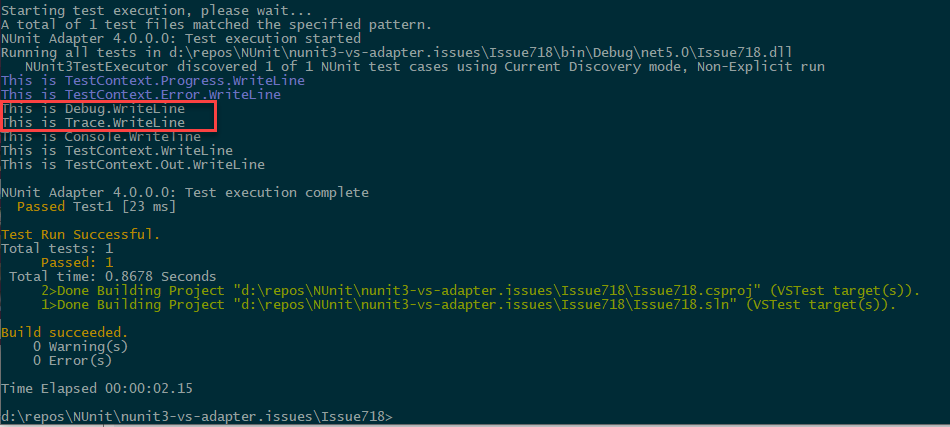

# How to enable Trace and Debug output

Trace and Debug output is by default not sent to the console output, or anywhere else.  If you want to have this output, you must add your own `TraceListener`.

## Implementing the `TraceListener` in your code

This is easy to do, and you can do it per assembly, per namespace or per test.  All it takes is to add the necessary initialization of the `TraceListener`.

To add it to a namespace, place the following class inside that namespace, and it will apply to all tests inside that namespace and below.  The code shown adds the output to console output.  If you like you can change that to another kind of listener.

```csharp
[SetUpFixture]
public class SetupTrace
{
    [OneTimeSetUp]
    public void StartTest()
    {
        Trace.Listeners.Add(new ConsoleTraceListener());
    }

    [OneTimeTearDown]
    public void EndTest()
    {
        Trace.Flush();
    }
}
```

If you place the code above outside of any namespace it will apply to the whole assembly.

If you'd like to only apply to a given test fixture/class, you can add the `StartTest and EndTest` methods to the given test fixture/class.

## Example outputs

Given the following verbose test:

```csharp
        [Test]
        public void Test1()
        {
            Debug.WriteLine("This is Debug.WriteLine");
            Trace.WriteLine("This is Trace.WriteLine");
            Console.WriteLine("This is Console.Writeline");
            TestContext.WriteLine("This is TestContext.WriteLine");
            TestContext.Out.WriteLine("This is TestContext.Out.WriteLine");
            TestContext.Progress.WriteLine("This is TestContext.Progress.WriteLine");
            TestContext.Error.WriteLine("This is TestContext.Error.WriteLine");
            Assert.Pass();
        }
```

With a `TraceListener`, the output in Visual Studio Test Explorer is:


Without the `TraceListener`, the blocks in red will not be present.

Running `dotnet test -v n`, the output will be:



## Discussion and source

This issue have been discussed at [Issue 718](https://github.com/nunit/nunit3-vs-adapter/issues/718) and [Issue 301](https://github.com/nunit/nunit3-vs-adapter/issues/301). Use of `TraceListener` suggested by [Frans Bouma](https://github.com/FransBouma).

The repro code for the issue can be found [here](https://github.com/nunit/nunit3-vs-adapter.issues/tree/master/Issue718).
